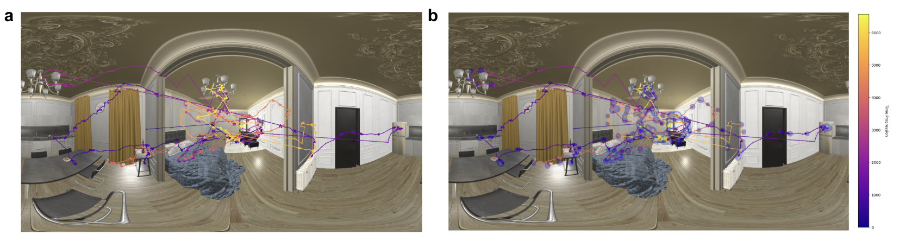

# Virtual Reality temporal linking project

1) VRTL-eye: preprocessing eye movements
2) VRTL-behavioral: analyzes behavioral rating for three tasks- attention-check, valence-arousal, memory-categorization
3) VRTL-classifier: LSTM model trained on CS+ and CS-

# eye movement animation

# heatmap of eye fixations

# timeline of CS + (i.e., zombie sequence)

